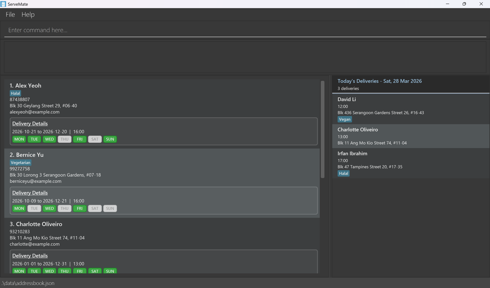
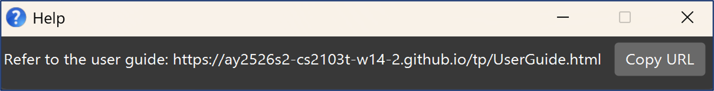
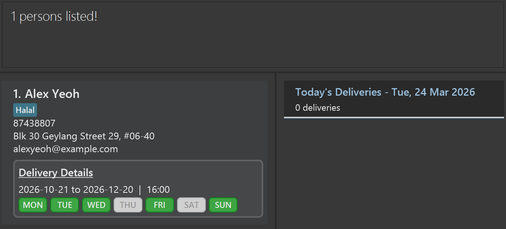

# ServeMate User Guide

## Introduction
Managing customer records and delivery schedules for a Tingkat catering business can quickly become overwhelming when information is scattered across spreadsheets, notebooks and chat messages.
This is where **ServeMate** comes in.

**ServeMate** is a desktop application designed to help administrative staff organize customer contacts and delivery details. Optimized for fast typing through a Command Line Interface (CLI), **ServeMate** allows you to quickly add, update, and retrieve customer records without navigating through complicated menus.

<!-- * Table of Contents -->
<page-nav-print />

--------------------------------------------------------------------------------------------------------------------

## Quick Start

1. Ensure that Java `17` or later installed on your computer. <br>
If Java is not installed, follow the installation guide for your operating system:
   * **Windows:** [Java installation guide for Windows](https://se-education.org/guides/tutorials/javaInstallationWindows.html).
   * **Mac:** [Java installation guide for Mac](https://se-education.org/guides/tutorials/javaInstallationMac.html).
   * **Linux:** [Java installation guide for Linux](https://se-education.org/guides/tutorials/javaInstallationLinux.html).

1. Download the latest `.jar` file from [here](https://github.com/AY2526S2-CS2103T-W14-2/tp/releases).

1. Copy the file to the folder you want to use as the _home folder_ for ServeMate.

1. Open a command terminal and run the application using:
   ```shell
   cd [home-folder]
   java -jar ServeMate.jar
   ```
   A GUI similar to the below should appear in a few seconds. Note how the app contains some sample data.<br>
   

1. Type the command in the command box and press Enter to execute it. e.g. typing **`help`** and pressing Enter will open the help window.<br>
   Some example commands you can try:

   * `list` : Lists all contacts.

   * `add n/John Doe p/98765432 e/johnd@example.com a/John street, block 123, #01-01` : Adds a contact named `John Doe` to ServeMate.

   * `delete 3` : Deletes the 3rd contact shown in the current list.

   * `clear` : Deletes all contacts.

   * `exit` : Exits the app.

1. Refer to the [Features](#features) below for details of each command.

--------------------------------------------------------------------------------------------------------------------

## Command summary

Action | Command Format (with Examples)
-----------------|-------------------------------------------------------------------------------------------------
**Getting help** | `help`
**Add customer** | `add n/NAME p/PHONE_NUMBER e/EMAIL a/ADDRESS [t/TAG]…`<br><br>Example:<br>`add n/James Ho p/22224444 e/jamesho@example.com a/123, Clementi Rd, 1234665 t/Vegan t/West`
**List all customers** | `list`
**Edit customer** | `edit INDEX [n/NAME] [p/PHONE_NUMBER] [e/EMAIL] [a/ADDRESS] [t/TAG]…`<br><br>Example:<br>`edit 2 n/James Lee e/jameslee@example.com`
**Delete customer** | `delete INDEX`<br><br>Example:<br>`delete 3`
**Find customers by attribute** | `find [n/NAME_KEYWORDS...] [a/ADDRESS_KEYWORDS...] [t/TAG_KEYWORDS...]`<br><br>Example:<br>`find n/James Jake a/Jurong`
**Find customers with delivery on date** | `find-delivery dt/DATE`<br><br>Example:<br>`find-delivery dt/2026-10-22`
**Find customers with delivery within date range** | `find-delivery st/START_DATE ed/END_DATE`<br><br>Example:<br>`find-delivery st/2026-10-27 ed/2026-11-10`
**Find customers with expired delivery** | `expired bf/DATE`<br><br>Example:<br>`expired bf/2026-12-22`
**Schedule delivery** | `schedule INDEX st/START_DATE ed/END_DATE tm/DELIVERY_TIME d/DELIVERY_DAYS`<br><br>Example:<br>`schedule 3 st/2026-04-09 ed/2026-04-21 tm/16:00 d/12367`
**Reschedule delivery** | `reschedule INDEX [st/START_DATE] [ed/END_DATE] [tm/DELIVERY_TIME] [d/DELIVERY_DAYS]`<br><br>Example:<br>`reschedule 3 ed/2026-04-21 tm/16:00`
**Unschedule delivery** | `unschedule INDEX`<br><br>Example:<br>`unschedule 3`
**Clear all entries** | `clear`
**Exit program** | `exit`

--------------------------------------------------------------------------------------------------------------------

## Features

<box type="info" light>

**Notes about the command format:**<br>

* Words in `UPPER_CASE` are the parameters to be supplied by the user.<br>
  e.g. in `add n/NAME`, `NAME` is a parameter which can be used as `add n/John Doe`.

* Items in square brackets are optional.<br>
  e.g. `n/NAME [t/TAG]` can be used as `n/John Doe t/Halal` or as `n/John Doe`.

* Items with `…`​ after them can be used multiple times including zero times.<br>
  e.g. `[t/TAG]…​` can be used as ` ` (i.e. 0 times), `t/Vegetarian`, `t/Vegetarian t/East` etc.

* Parameters can be in any order.<br>
  e.g. if the command specifies `n/NAME p/PHONE_NUMBER`, `p/PHONE_NUMBER n/NAME` is also acceptable.

* Extraneous parameters for commands that do not take in parameters (such as `help`, `list`, `exit` and `clear`) will be ignored.<br>
  e.g. if the command specifies `help 123`, it will be interpreted as `help`.

* Dates are in `yyyy-MM-dd` format, where `yyyy` is the 4-digit year, `MM` is the 2-digit month, and `dd` is the 2-digit day.<br>
  e.g. 9th March 2026 can be written has `2026-03-09`.

* If you are using a PDF version of this document, be careful when copying and pasting commands that span multiple lines as space characters surrounding line-breaks may be omitted when copied over to the application.
</box>

### Getting help: `help`

Displays a help message with a link to access ServeMate's User Guide.



Format: `help`


### Adding a customer: `add`

Creates a new customer record.

Format: `add n/NAME p/PHONE_NUMBER e/EMAIL a/ADDRESS [t/TAG]…​`

<box type="tip" light>

**Tip:** A customer can have any number of tags (including 0)
</box>

Examples:
* `add n/John Doe p/98765432 e/johnd@example.com a/John street, block 123, #01-01`
* `add n/Betsy Crowe t/Halal e/betsycrowe@example.com a/Newgate Prison p/1234567 t/criminal`

### Listing all customers: `list`

Displays basic information of all customers.

Format: `list`

### Editing a customer: `edit`

Updates an existing customer’s information.

Format: `edit INDEX [n/NAME] [p/PHONE] [e/EMAIL] [a/ADDRESS] [t/TAG]…​`

* Edits the customer at the specified `INDEX`. The index refers to the index number shown in the displayed customer list. The index **must be a positive integer** 1, 2, 3, …​
* At least one of the optional fields must be provided.
* Existing values will be updated to the input values.
* When editing tags, the existing tags of the customer will be removed i.e adding of tags is not cumulative.
* You can remove all the customer’s tags by typing `t/` without
    specifying any tags after it.

Examples:
*  `edit 1 p/91234567 e/johndoe@example.com` Edits the phone number and email address of the 1st customer to be `91234567` and `johndoe@example.com` respectively.
*  `edit 2 n/Betsy Crower t/` Edits the name of the 2nd customer to be `Betsy Crower` and clears all existing tags.

### Deleting a customer : `delete`

Deletes the specified customer and the delivery associated with them.

Format: `delete INDEX`

* Deletes the customer at the specified `INDEX`.
* The index refers to the index number shown in the displayed customer list.
* The index **must be a positive integer** 1, 2, 3, …

Examples:
* `list` followed by `delete 2` deletes the 2nd customer on the list.
* `find n/Betsy` followed by `delete 1` deletes the 1st customer in the results of the `find` command.

### Finding customers by attributes: `find`

Find customers whose attributes (name, address, tag) match at least 1 of the keywords given in each filter (`n/`, `a/`, `t/`) specified.

Format: `find [n/NAME_KEYWORDS...] [a/ADDRESS_KEYWORDS...] [t/TAG_KEYWORDS...]`

* The search is case-insensitive. e.g `n/hans` will match a customer with the name `Hans`.
* Only full words will be matched e.g. `n/Han` will not match a customer with the name `Hans`.
* The order of keywords do not matter. e.g. `n/Hans Bo` is the same as `n/Bo Hans`.
* The order of filters do not matter. e.g. `n/John t/Tampines` is the same as `t/Tampines n/John`.
* At least 1 filter with a keyword must be specified.
* If a filter is not specified or there are no keywords, the filter is *not applied*.
* Only customers matching *all* filters specified will be displayed.
* For each filter, multiple keywords (each separated by a space) can be specified. A customer matches the filter if *at least one* keyword matches (i.e. `OR` search).
  e.g. `n/John Lily t/Vegetarian` will return all your customers whose name is `John` or `Lily`, and tagged with dietary restriction `Vegetarian`.

Examples:
* `find a/Jurong` displays all customers with address containing `Jurong`.
* `find t/Vegetarian` displays all customers tagged with dietary restriction `Vegetarian`.
* `find n/Alex t/Vegetarian` displays customers whose name is `Alex` *and* tagged with dietary restriction `Vegetarian`.
* `find n/Bernice a/Yishun Jurong` displays customers whose name is `Bernice` *and* with address containing `Yishun` or `Jurong`.
* `find n/Alex Bernice a/Yishun t/Vegetarian` displays customers whose name is `Alex` or `Bernice`, with address containing `Yishun` *and* tagged with dietary restriction `Vegetarian`.<br>
  

### Finding deliveries on a given date: `find-delivery`

Finds customers who have a delivery scheduled on the given date or within the given date range.

Format: `find-delivery dt/DATE` or `find-delivery st/START_DATE ed/END_DATE`

* All dates must be in the format `yyyy-MM-dd`, where `yyyy` is the 4-digit year, `MM` is the 2-digit month, and `dd` is the 2-digit day. e.g. `2026-04-01`
* `dt/` searches for an exact date. `st/` and `ed/` must be used together to search within a date range.
* A customer is shown only if all of the following criteria are met:
  * They have a delivery assigned.
  * The customer has a scheduled delivery that falls on the given date or within the date range specified (including the start and end dates itself).
* If no customers match, an empty list is shown.

Examples:
* `find-delivery dt/2026-04-01` returns all customers with a delivery on Wednesday, 1 April 2026.
* `find-delivery st/2026-04-01 ed/2026-04-30` returns all customers with a delivery scheduled within April 2026.

### Finding customers with expired delivery: `expired`

Finds all customers with deliveries that have expired before the given date.

Format: `expired bf/DATE`
* `DATE` is in the format `yyyy-MM-dd` (e.g., 2026-04-09).
* Displays all customers whose delivery end date is **before** the specified date on the customer panel.
* Deliveries that end on the exact date specified is **not** considered as expired.
* Customers without a delivery will not be displayed.

Examples:
* `expired bf/2026-12-21` displays all customers whose deliveries have ended before 21 December 2026.
  

### Scheduling a delivery : `schedule`

Adds a delivery or overwrites the existing delivery associated with the specified customer.

Format: `schedule INDEX st/START_DATE ed/END_DATE tm/DELIVERY_TIME d/DELIVERY_DAYS`

* Adds the delivery for the customer at the specified `INDEX`.
* If the specified customer already has a delivery, the delivery field is overwritten.
* The index refers to the index number shown in the displayed customer list.
* The index **must be a positive integer** 1, 2, 3, …​
* `DELIVERY_DAYS` must be a set of numbers **within the range of 1-7 inclusive** without whitespaces where 1 = Monday, 2 = Tuesday, …​, 7 = Sunday.
* `24:00` is not a valid value for `DELIVERY_TIME`.

Examples:
* `schedule 1 st/2026-02-01 ed/2026-02-02 tm/13:00 d/12` adds a delivery for the 1st customer on the list. The delivery starts on 1 February 2026, ends on 2 February 2026 and occurs at 1 PM on Mondays and Tuesdays.
* `schedule 4 st/2026-03-11 ed/2026-04-01 tm/15:30 d/246` adds a delivery for the 4th customer on the list. The delivery starts on 11 March 2026, ends on 1 April 2026 and occurs at 3:30 PM on Tuesday, Thursdays and Saturdays.

### Unscheduling a delivery : `unschedule`

Deletes the delivery associated with the specified customer.

Format: `unschedule INDEX`

* Deletes the delivery for the customer at the specified `INDEX`.
* The specified customer must have an existing delivery.
* The index refers to the index number shown in the displayed customer list.
* The index **must be a positive integer** 1, 2, 3, …

Examples:
* `list` followed by `unschedule 2` deletes the delivery for the 2nd customer on the list.
* `find n/Bernice` followed by `unschedule 1` deletes the delivery for the 1st customer in the results of the `find` command.
  

### Editing a delivery : `reschedule`

Edits the delivery associated with the specified customer.

Format: `reschedule INDEX [st/START_DATE] [ed/END_DATE] [tm/DELIVERY_TIME] [d/DELIVERY_DAYS]`

* Parameters `st/`, `ed/`, `tm/` and `d/` are optional, but at least one of them must be provided.
* Existing values will be updated to the input values.Edits the delivery associated with the customer at the specified `INDEX`.
* The specified customer must have an existing delivery.
* The index refers to the index number shown in the displayed customer panel.
* The index **must be a positive integer** 1, 2, 3, …​

Examples:
* `reschedule 1 ed/2026-02-02 tm/12:59` Edits the delivery end date and delivery time for the 1st customer to be `2026-02-02` and `12:59` respectively.
* `reschedule 4 d/25` Edits the delivery days for the 4th customer to be `25` (Tuesday and Friday).

### Clearing all entries : `clear`

Deletes **all** customer records and their delivery details (if any). This operation **cannot be undone** and **data cannot be recovered**.

<box type="warning" light>

**Warning:**
This action is permanent and cannot be undone. Ensure that you have thoroughly reviewed and backed up any necessary data before proceeding.
</box>

Format: `clear`

### Exiting the program : `exit`

Exits the program.

Format: `exit`

### Saving the data

ServeMate data are saved in the hard disk automatically after any command that changes the data. There is no need to save manually.

### Editing the data file

ServeMate data are saved automatically as a JSON file `[JAR file location]/data/addressbook.json`. Advanced users are welcome to update data directly by editing that data file.

<box type="warning" light>

**Warning:**
If your changes to the data file makes its format invalid, ServeMate will discard all data and start with an empty data file at the next run.  Hence, it is recommended to take a backup of the file before editing it.<br>
Furthermore, certain edits can cause the ServeMate to behave in unexpected ways (e.g., if a value entered is outside the acceptable range). Therefore, edit the data file only if you are confident that you can update it correctly.
</box>

--------------------------------------------------------------------------------------------------------------------

## FAQ

**Q**: How do I transfer my data to another computer?<br>
**A**: Install the app in the other computer and overwrite the empty data file it creates with the file that contains the data of your previous ServeMate home folder.

--------------------------------------------------------------------------------------------------------------------

## Known issues

1. **When using multiple screens**, if you move the application to a secondary screen, and later switch to using only the primary screen, the GUI will open off-screen. The remedy is to delete the `preferences.json` file created by the application before running the application again.
2. **If you minimize the Help Window** and then run the `help` command (or use the `Help` menu, or the keyboard shortcut `F1`) again, the original Help Window will remain minimized, and no new Help Window will appear. The remedy is to manually restore the minimized Help Window.
