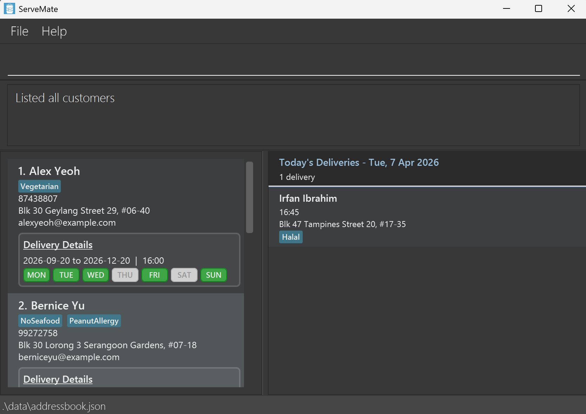
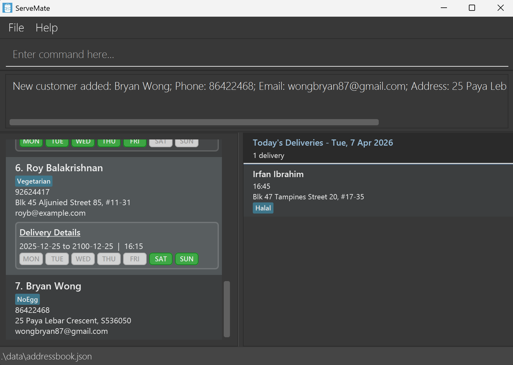
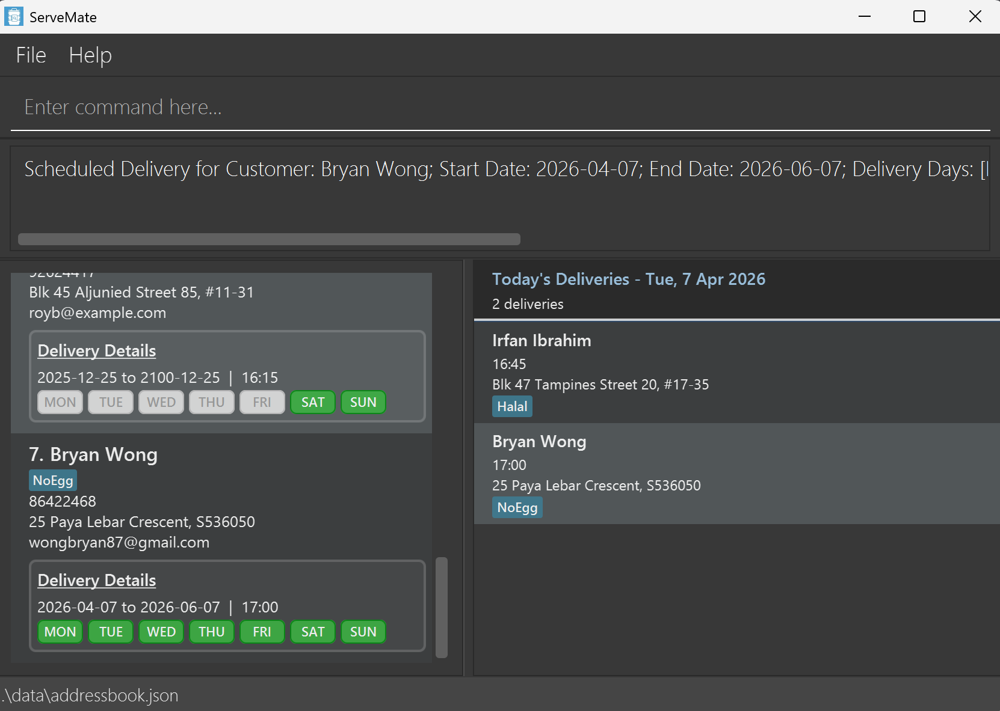
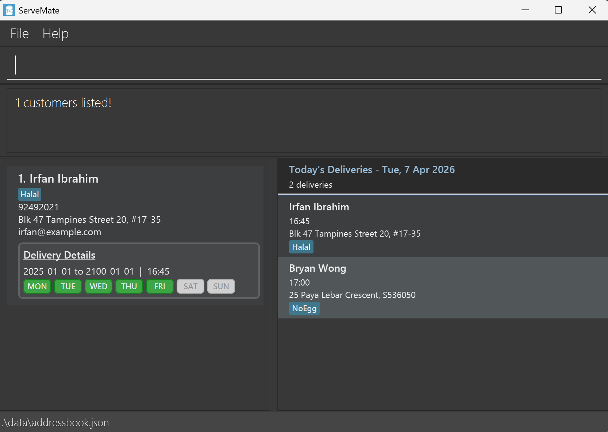
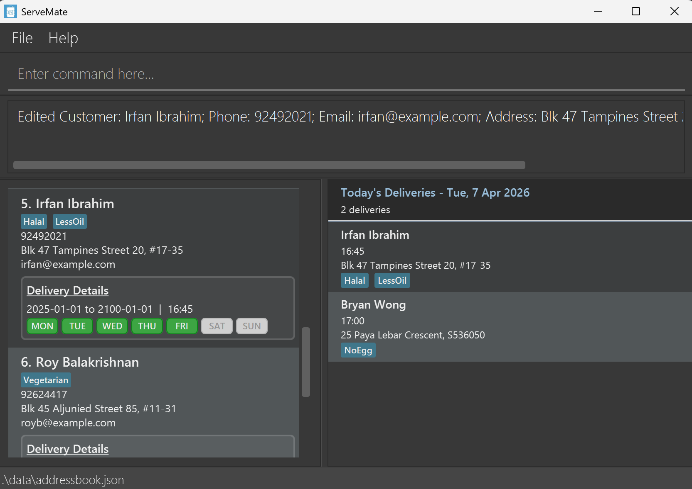
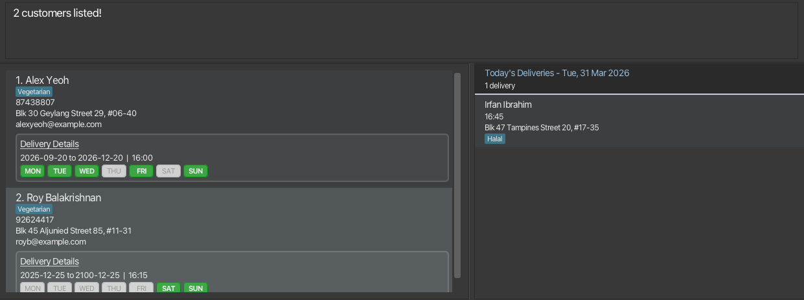
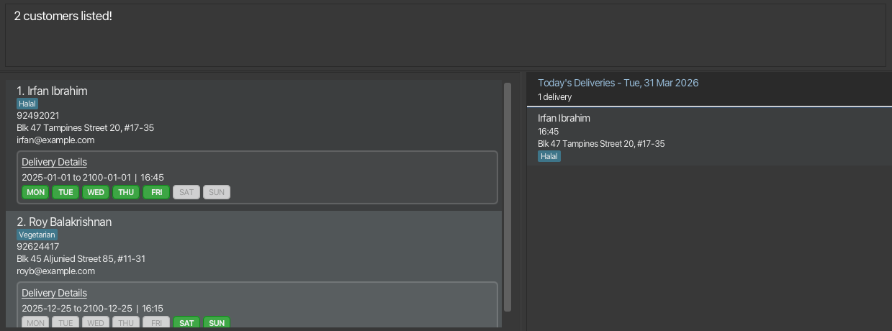
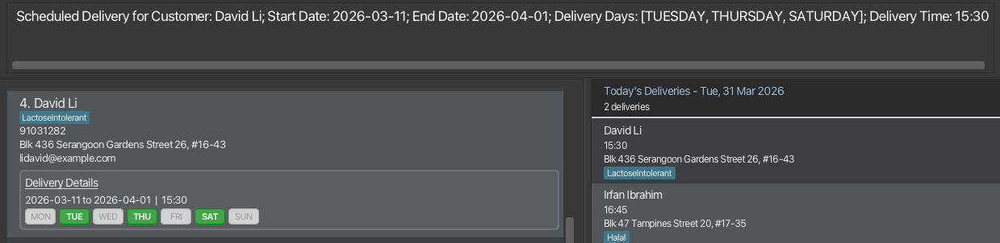
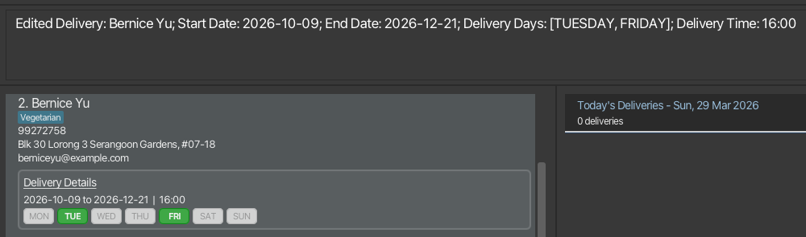

# ServeMate User Guide

## Introduction
Managing customer records and delivery schedules for a Tingkat catering business can quickly become overwhelming when information is scattered across spreadsheets, notebooks and chat messages.
This is where **ServeMate** comes in.

**ServeMate** is a desktop application designed to help administrative staff of Tingkat caterers organize customer contacts and delivery details. Optimized for fast typing using text-based commands, **ServeMate** allows you to quickly add, update, and retrieve customer records without navigating through complicated menus.

<!-- * Table of Contents -->
<page-nav-print />

--------------------------------------------------------------------------------------------------------------------

## Quick start

Welcome to **ServeMate**, the mate that helps you serve faster. Follow these simple steps to start using ServeMate today!

1. ServeMate needs a helper program called **Java 17** to run.<br>
   * If you do not have Java installed or are unsure, follow the installation guide for your computer:
     * **For Windows users:** [Java installation guide for Windows](https://se-education.org/guides/tutorials/javaInstallationWindows.html#java-17-installation-guide-for-windows-users).
     * **For Mac users:** [Java installation guide for Mac](https://se-education.org/guides/tutorials/javaInstallationMac.html#java-17-installation-guide-for-mac-users).
     * **For Linux users:** [Java installation guide for Linux](https://se-education.org/guides/tutorials/javaInstallationLinux.html#java-17-installation-guide-for-linux-users).
2. Download the latest `ServeMate.jar` file from [this link](https://github.com/AY2526S2-CS2103T-W14-2/tp/releases).
3. Move `ServeMate.jar` to a folder that is easily accessible for you.
4. Launch ServeMate.
   * **For Windows users:**
     1. Open the folder where you saved `ServeMate.jar`.
     2. Click on the **address bar** at the top (where the folder name is), type `cmd` and press **Enter**.
     3. A window should pop up. On this window, type `java -jar ServeMate.jar` and press **Enter**.
    <!--
    @@author DenseLance-alt-reused
    Reused from https://support.apple.com/en-ca/guide/terminal/trmlb20c7888/2.15/mac/26
     with minor modifications
    -->
   * **For Mac users:**
     1. Open a Finder window, then navigate to the folder where you saved `ServeMate.jar`.
     2. If there is no **path bar** at the bottom of the Finder window, click **View** in the top menu bar and select **Show Path Bar**.
     3. Right-click the folder name at the very end of **path bar** and select **Open in Terminal**.
     4. A window should pop up. On this window, type `java -jar ServeMate.jar` and press **Return**.
    <!-- @@author -->
    <!--
    @@author DenseLance-alt-reused
    Reused from https://askubuntu.com/a/969311
     with minor modifications
    -->
   * **For Linux users:**
     1. Right-click the folder where you saved `ServeMate.jar`.
     2. Select **Open in Terminal**.
     3. A window should pop up. On this window, type `java -jar ServeMate.jar` and press **Enter**.
    <!-- @@author -->
5. The ServeMate window should appear in a few seconds. You are now ready to use ServeMate!

--------------------------------------------------------------------------------------------------------------------

## Dashboard layout

The ServeMate window should look like the image below. Notice how the app contains some sample data.
<br><br>
<!-- @@author elijah-ng -->

* The customer panel on the left allows you to view customer information, including their full delivery details.
* The delivery panel on the right allows you to view today's deliveries. It provides a quick reference to view deliveries scheduled for the current day, from earliest to latest delivery time.
* You can adjust the width of the panels by left-clicking and dragging the divider between them.

<box type="info">

**Note:** The date shown in the delivery panel is based on your computer's date setting. If you find today's date is incorrectly reflected, check that your computer's date is correct, then close and relaunch ServeMate.
</box>
<!-- @@author -->

--------------------------------------------------------------------------------------------------------------------

## Step-by-step tutorial

Meet Mdm Tan, an experienced administrative staff at a Tingkat catering business. Let's see how she handles her morning rush with ease using **ServeMate**!

<box type="info">

**Note:** This tutorial uses the sample data that comes preloaded with ServeMate so that you can practice right away.
Please note that your screen might look different from the screenshots below, because what you see for the **delivery panel** on the right depends on your computer's date.
</box>
<br>

### Viewing all customer records
Before the day starts, Mdm Tan wants to check the full list of customers.
<br>

She types the `list` command into the command box at the top, and the customer panel on the left is updated:
<br>
<br><br>

### Welcoming a new customer
The phone rings. It's Bryan Wong from Paya Lebar who wants to start a Tingkat service for his family. He requests for his meals to not contain eggs.
<br>

As Bryan provides his contact details, Mdm Tan quickly types the `add` command:
```text
add n/Bryan Wong p/86422468 a/25 Paya Lebar Crescent, S536050 e/wongbryan87@gmail.com t/NoEgg
```
<br>

Bryan appears instantly in the customer panel on the left, and becomes the 7th customer on the list:
<br>
<br>

Now that Bryan has finally paid for his daily Tingkat plan from 7 April 2026 to 7 June 2026, Mdm Tan starts to schedule his recurring 5pm delivery:
```text
schedule 7 st/2026-04-07 ed/2026-06-07 d/1234567 tm/17:00
```
<br>

<box type="info">

**Note:** The examples provided in this tutorial use **7 April 2026** as today's date. To see Bryan’s name appear in the delivery panel, ensure that `st/` (start date) is today, and `ed/` (end date) is 2 months later.
</box>
<br>

Since Bryan’s Tingkat plan starts today, his delivery will also be added to the delivery panel on the right:
<br>
<br><br>

### Handling customer feedback
An hour later, Mdm Tan receives a Whatsapp message. This time, it is Irfan from Tampines who complains about yesterday's meal being too oily.
<br>

Instead of slowly scrolling through the entire list of customers, Mdm Tan uses the `find` command to locate Irfan's contact:
```text
find n/Irfan a/Tampines
```
<br>

The customer panel will display a filtered list containing all customers with the name `Irfan` and address in `Tampines`:
<br>
<br><br>

Next, Mdm Tan uses the `edit` command to update Irfan's tags to reflect his preference for less oily food:
```text
edit 1 t/Halal t/LessOil
```
<br>

<box type="warning">

**Warning:** When you use the `edit` command to add new tags to a customer, ServeMate will **replace** the old tags. You should always include the original tags (e.g. `Halal`) in your command if you want to keep them!
</box>
<br>

Mdm Tan checks that Irfan's record is updated correctly:
<br>
<br><br>

<box type="success" icon=":tada:">

**Congratulations!** You are now ready to use ServeMate for your daily tasks!
</box>
<br>

### What's next

While this tutorial covers the daily essentials, ServeMate has many other commands to help you stay organized.
You can refer to the [Features](#features) section below to look up details about a specific command.

--------------------------------------------------------------------------------------------------------------------

## Command summary

| Action                                             | Command Format (with Examples)                                                                                                                                          |
|----------------------------------------------------|-------------------------------------------------------------------------------------------------------------------------------------------------------------------------|
| **Getting help**                                   | `help`                                                                                                                                                                  |
| **Add customer**                                   | `add n/NAME p/PHONE_NUMBER e/EMAIL a/ADDRESS [t/TAG]…`<br><br>Example:<br>`add n/James Ho p/22224444 e/jamesho@example.com a/123, Clementi Rd, 1234665 t/Halal t/NoEgg` |
| **List all customers**                             | `list`                                                                                                                                                                  |
| **Edit customer**                                  | `edit INDEX [n/NAME] [p/PHONE_NUMBER] [e/EMAIL] [a/ADDRESS] [t/TAG]…`<br><br>Example:<br>`edit 2 n/James Lee e/jameslee@example.com`                                    |
| **Delete customer**                                | `delete INDEX`<br><br>Example:<br>`delete 3`                                                                                                                            |
| **Find customers by attribute**                    | `find [n/NAME_KEYWORDS...] [a/ADDRESS_KEYWORDS...] [t/TAG_KEYWORDS...]`<br><br>Example:<br>`find n/James Jake a/Jurong`                                                 |
| **Find customers with delivery on date**           | `find-delivery dt/DATE`<br><br>Example:<br>`find-delivery dt/2026-10-22`                                                                                                |
| **Find customers with delivery within date range** | `find-delivery st/START_DATE ed/END_DATE`<br><br>Example:<br>`find-delivery st/2026-10-27 ed/2026-11-10`                                                                |
| **Find customers with expired delivery**           | `expired bf/DATE`<br><br>Example:<br>`expired bf/2026-12-22`                                                                                                            |
| **Schedule delivery**                              | `schedule INDEX st/START_DATE ed/END_DATE tm/DELIVERY_TIME d/DELIVERY_DAYS`<br><br>Example:<br>`schedule 3 st/2026-04-09 ed/2026-04-21 tm/16:00 d/12367`                |
| **Reschedule delivery**                            | `reschedule INDEX [st/START_DATE] [ed/END_DATE] [tm/DELIVERY_TIME] [d/DELIVERY_DAYS]`<br><br>Example:<br>`reschedule 3 ed/2026-04-21 tm/16:00`                          |
| **Unschedule delivery**                            | `unschedule INDEX`<br><br>Example:<br>`unschedule 3`                                                                                                                    |
| **Clear all entries**                              | `clear`                                                                                                                                                                 |
| **Exit program**                                   | `exit`                                                                                                                                                                  |

--------------------------------------------------------------------------------------------------------------------

## Features

<box type="info">

**Notes about the command format:**<br>

* Command words are case-insensitive.<br>
  e.g. `liSt`, `List` and `LIST` all refer to the `list` command.

* Words in `UPPER_CASE` are the parameters to be supplied by the user.<br>
  e.g. in `add n/NAME`, `NAME` is a parameter which can be used as `add n/John Doe`.

* Items in square brackets are optional.<br>
  e.g. `n/NAME [t/TAG]` can be used as `n/John Doe t/Halal` or as `n/John Doe`.

* Items with `…`​ after them can be used multiple times including zero times.<br>
  e.g. `[t/TAG]…​` can be used as ` ` (i.e. 0 times), `t/Vegetarian`, `t/Vegetarian t/NoSeafood` etc.

* Parameters can be in any order.<br>
  e.g. if the command specifies `n/NAME p/PHONE_NUMBER`, `p/PHONE_NUMBER n/NAME` is also acceptable.

* Extraneous parameters for commands that do not take in parameters (such as `help`, `list`, `exit` and `clear`) will be ignored.<br>
  e.g. if the command specifies `help 123`, it will be interpreted as `help`.

* Dates are in `yyyy-MM-dd` format, where `yyyy` is the 4-digit year, `MM` is the 2-digit month, and `dd` is the 2-digit day.<br>
  e.g. 9th March 2026 can be written as `2026-03-09`.

* Times should be in the 24-hour `HH:mm` format, where `HH` is the 2-digit hour and `mm` is the 2-digit minute, and be between `00:00` and `23:59`.<br>
  e.g. 9:30 PM can be written as `21:30`.

* Tags (`t/[TAG]`) are intended for use in placing delivery notes for a particular customer.
  * Tags should only consist of alphanumerical values without whitespaces.
  * Suggested usages:
    * Dietary restrictions of the customer (i.e. `t/Vegetarian`).
    * The region where the customer lives (i.e. `t/West`).

* If you are using a PDF version of this document, be careful when copying and pasting commands that span multiple lines as space characters surrounding line-breaks may be omitted when copied over to the application.
</box>

### Getting help: `help`

Displays a help message with a link to access ServeMate's User Guide.
<br>

Format: `help`

<br>

### Adding a customer: `add`

Creates a new customer record.

Format: `add n/NAME p/PHONE_NUMBER e/EMAIL a/ADDRESS [t/TAG]…​`

<box type="tip">

**Tip:** A customer can have any number of tags (including 0)
</box>

Examples:
* `add n/John Doe p/98765432 e/johnd@example.com a/John street, block 123, #01-01`
* `add n/Betsy Crowe t/LactoseIntolerant e/betsycrowe@example.com a/Newton Rd p/1234567 t/Vegetarian`
  <br>

<br>

### Listing all customers: `list`

Displays basic information of all customers.

Format: `list`

<br>

### Editing a customer: `edit`

Updates an existing customer’s information.

Format: `edit INDEX [n/NAME] [p/PHONE] [e/EMAIL] [a/ADDRESS] [t/TAG]…​`

* Edits the customer at the specified `INDEX`. The index refers to the index number shown in the displayed customer list. The index **must be a positive integer** 1, 2, 3, …​
* At least one of the optional fields must be provided.
* Existing values will be updated to the input values.
* When editing tags, the existing tags of the customer will be removed i.e adding of tags is not cumulative.
* You can remove all the customer’s tags by typing `t/` without
    specifying any tags after it.

Examples:
*  `edit 1 p/91234567 e/johndoe@example.com` Edits the phone number and email address of the 1st customer to be `91234567` and `johndoe@example.com` respectively.
*  `edit 2 n/Betsy Crower t/` Edits the name of the 2nd customer to be `Betsy Crower` and clears all existing tags.
  <br>

<br>

### Deleting a customer : `delete`

Deletes the specified customer and the delivery associated with them.

Format: `delete INDEX`

* Deletes the customer at the specified `INDEX`.
* The index refers to the index number shown in the displayed customer list.
* The index **must be a positive integer** 1, 2, 3, …

Examples:
* `list` followed by `delete 2` deletes the 2nd customer on the list.
* `find n/Alex` displays the list of customers whose names contain `Alex`, followed by `delete 1` which deletes the 1st customer in the results of that `find` command.

<br>

### Finding customers by attributes: `find`

Find customers whose attributes (name, address, tag) match at least 1 of the keywords given in each filter (`n/`, `a/`, `t/`) specified.

Format: `find [n/NAME_KEYWORDS...] [a/ADDRESS_KEYWORDS...] [t/TAG_KEYWORDS...]`

* The search is case-insensitive. e.g `n/hans` will match a customer whose name contains `Hans`.
* Only full words will be matched e.g. `n/Han` will not match a customer with the name `Hans`.
* The order of keywords does not matter. e.g. `n/Hans Bo` is the same as `n/Bo Hans`.
* The order of filters do not matter. e.g. `n/John t/Halal` is the same as `t/Halal n/John`.
* At least 1 filter with a keyword must be specified.
* If a filter is not specified or there are no keywords, the filter is *not applied*.
* Only customers matching *all* filters specified will be displayed.
* For each filter, multiple keywords (each separated by a space) can be specified. A customer matches the filter if *at least one* keyword matches (i.e. `OR` search).
  e.g. `n/John Lily t/Vegetarian` will return all your customers whose names contain `John` or `Lily`, and tagged with dietary restriction `Vegetarian`.

Examples:
* `find a/Jurong` displays all customers with address containing `Jurong`.
* `find t/Vegetarian` displays all customers tagged with dietary restriction `Vegetarian`.
* `find n/Alex t/Vegetarian` displays customers whose names contain `Alex` *and* tagged with dietary restriction `Vegetarian`.
* `find n/Bernice a/Yishun Jurong` displays customers whose names contain `Bernice` *and* with address containing `Yishun` or `Jurong`.
* `find n/Alex Roy a/Street t/Vegetarian` displays customers whose names contain `Alex` or `Roy`, with address containing `Street` *and* tagged with dietary restriction `Vegetarian`.
  <br>

<br>

### Finding customers by delivery date or date range: `find-delivery`

Finds customers who have a delivery scheduled on the given date or within the given date range.

Format: `find-delivery dt/DATE` or `find-delivery st/START_DATE ed/END_DATE`

* All dates must be in the format `yyyy-MM-dd`, where `yyyy` is the 4-digit year, `MM` is the 2-digit month, and `dd` is the 2-digit day. e.g. `2026-04-01`
* `dt/` searches for an exact date. `st/` and `ed/` must be used together to search within a date range.
* A customer is shown only if all of the following criteria are met:
  * They have a delivery assigned.
  * The given date, or at least one date within the given date range, falls within the customer’s delivery period (including the start and end dates).
  * That matching date is one of the customer’s scheduled delivery days.
* If no customers match, an empty list is shown.

Examples:
* `find-delivery dt/2026-04-01` returns all customers with a delivery on Wednesday, 1 April 2026.
* `find-delivery st/2026-04-01 ed/2026-04-30` returns all customers with a delivery scheduled within April 2026.
  <br>

<br>

### Finding customers with expired delivery: `expired`

Finds all customers with deliveries that have expired before the given date.

Format: `expired bf/DATE`
* `DATE` is in the format `yyyy-MM-dd` (e.g., 2026-04-09).
* Displays all customers whose delivery end date is **before** the specified date on the customer panel.
* Deliveries that end exactly on the specified date are **not** considered as expired.
* Customers without a delivery will not be displayed.

Examples:
* `expired bf/2026-12-21` displays all customers whose deliveries have ended before 21 December 2026.
  <br>

<br>

### Scheduling a delivery : `schedule`

Adds a delivery to the specified customer.

Format: `schedule INDEX st/START_DATE ed/END_DATE tm/DELIVERY_TIME d/DELIVERY_DAYS`

* Adds the delivery for the customer at the specified `INDEX`.
* If the specified customer already has a delivery, adding a new delivery to the same customer should not be allowed using this command.
* The index refers to the index number shown in the displayed customer list.
* The index **must be a positive integer** 1, 2, 3, …​
* `DELIVERY_DAYS` must be a set of numbers **within the range of 1-7 inclusive** without whitespaces where 1 = Monday, 2 = Tuesday, …​, 7 = Sunday.

Examples:
* `schedule 1 st/2026-02-01 ed/2026-02-02 tm/13:00 d/12` adds a delivery for the 1st customer on the list. The delivery starts on 1 February 2026, ends on 2 February 2026 and occurs at 1 PM on Mondays and Tuesdays.
* `schedule 4 st/2026-03-11 ed/2026-04-01 tm/15:30 d/246` adds a delivery for the 4th customer on the list. The delivery starts on 11 March 2026, ends on 1 April 2026 and occurs at 3:30 PM on Tuesday, Thursdays and Saturdays.
  <br>

<br>

<!-- @@author MrMarshall12 -->

### Editing a delivery : `reschedule`

Edits the delivery associated with the specified customer.

Format: `reschedule INDEX [st/START_DATE] [ed/END_DATE] [tm/DELIVERY_TIME] [d/DELIVERY_DAYS]`

* Parameters `st/`, `ed/`, `tm/` and `d/` are optional, but at least one of them must be provided.
* Existing values will be updated to the input values.
* Edits the delivery associated with the customer at the specified `INDEX`.
* The specified customer must have an existing delivery.
* The index refers to the index number shown in the displayed customer panel.
* The index **must be a positive integer** 1, 2, 3, …​
* `DELIVERY_DAYS` must be a set of numbers **within the range of 1-7 inclusive** without whitespaces where 1 = Monday, 2 = Tuesday, …​, 7 = Sunday.

Examples:
* `reschedule 1 ed/2026-02-02 tm/12:45` Edits the delivery end date and delivery time for the 1st customer to be `2026-02-02` and `12:45` respectively.
* `reschedule 2 d/25` Edits the delivery days for the 2nd customer to be `25` (Tuesday and Friday).
  <br>

<!-- @@author  -->

<br>

### Unscheduling a delivery : `unschedule`

Deletes the delivery associated with the specified customer.

Format: `unschedule INDEX`

* Deletes the delivery for the customer at the specified `INDEX`.
* The specified customer must have an existing delivery.
* The index refers to the index number shown in the displayed customer list.
* The index **must be a positive integer** 1, 2, 3, …

Examples:
* `list` followed by `unschedule 2` deletes the delivery for the 2nd customer on the list.
* `find n/Bernice` followed by `unschedule 1` deletes the delivery for the 1st customer in the results of the `find` command.
<br>

<br>

### Clearing all entries : `clear`

Deletes **all** customer records and their delivery details (if any).

<box type="warning">

**Warning:**
This action **cannot be undone** and results in a **permanent loss of data**. Ensure that you have thoroughly reviewed and backed up any necessary data before proceeding.
</box>

Format: `clear`

<br>

### Exiting the program : `exit`

Exits the program.

Format: `exit`

<br>

### Saving the data

ServeMate data are saved in the hard disk automatically after any command that changes the data. There is no need to save manually.

<br>

### Editing the data file

ServeMate data are saved automatically as a JSON file `[JAR file location]/data/addressbook.json`. Advanced users are welcome to update data directly by editing that data file.

<box type="warning">

**Warning:**
If your changes to the data file makes its format invalid, ServeMate will discard all data and start with an empty data file at the next run. Hence, it is recommended to take a backup of the file before editing it.<br>
Furthermore, certain edits can cause the ServeMate to behave in unexpected ways (e.g., if a value entered is outside the acceptable range). Therefore, edit the data file only if you are confident that you can update it correctly.
</box>

--------------------------------------------------------------------------------------------------------------------

## FAQ

1. **Question**: How do I transfer my data to another computer?<br>
   **Answer**: Install the ServeMate application on your second computer by following the instructions in the "Quick Start" section. On your original computer, locate the `[JAR file location]/data` folder which should contain the `addressbook.json` data file. Copy the `data` folder to your second computer, and place it in the ServeMate application folder located at `[JAR file location]` (if the `data` folder already exists, replace it). Run the ServeMate application on your second computer. You should be able to see the data you have transferred.

<br>

2. **Question**: Why does the delivery panel not automatically update today's date and deliveries when the time passes 12 midnight?<br>
   **Answer**: ServeMate currently does not support automatically refreshing the date on the delivery panel if the time passes 12 midnight, in case you are still referring to the previous day's deliveries. To refresh the date on the panel, simply close and relaunch ServeMate.

<br>

3. **Question**: Why can't I use the delivery panel to view deliveries on other dates?<br>
   **Answer**: ServeMate currently does not support viewing deliveries on other dates in the delivery panel. The delivery panel is intended as a quick reference to view deliveries scheduled on the current day for your operations. If you need to view deliveries on other dates, you can use the `find-delivery` command.

<br>

4. **Question**: Why is the delivery panel wider than the customer panel when I make the ServeMate application window narrower?<br>
   **Answer**: When the ServeMate application window is narrow, the delivery panel is given a larger width to provide a quick reference to deliveries scheduled on the current day. If you need to view more information in the customer panel, you can resize the application window and expand the customer panel for a better viewing experience.

<br>

5. **Question**: Why does the delivery panel have a horizontal scrollbar at the bottom when there are long names or addresses that exceed the panel's width?<br>
   **Answer**: ServeMate's delivery panel uses horizontal scrolling to ensure that delivery information for the current day can be quickly scanned through, even when the names or addresses are long. It is designed to provide a quick reference for viewing deliveries at a glance. To maintain a readable layout even when the delivery panel is resized to a narrower width, longer names and addresses are kept to a single line. However, tags may still appear on multiple lines as they are typically short and fewer in number. If you would like to view the full information for a delivery, simply use the horizontal scroll bar at the bottom.

<br>

6. **Question**: Why does the `find` command only return customers that matches all filters?<br>
   **Answer**: ServeMate's `find` command is designed to match all filters so you can easily narrow down to the most relevant results to find the customer that you are looking for (e.g. `find n/John a/Clementi` finds all customers named `John` with an address containing `Clementi`).<br>
   If you like to find customers matching any of the filters (e.g. find all customers with name `Richard` or address `Jurong`), you may issue separate commands (e.g. `find n/Richard` and `find a/Jurong`).

<br>

7. **Question**: Why does the `find` command use full word matching for keywords?<br>
   **Answer**: ServeMate's `find` command does not support partial word matching, to reduce the number of irrelevant results returned so that you can find customers quickly. For example, filtering addresses with the keyword `18` will not match `18,`. In the event that you might not remember exactly the full word to search for (e.g. `Richard` or `Richards`), you may specify multiple keywords within a filter (e.g. `find n/Richard Richards`) to find customers matching any 1 keyword.

<br>

8. **Question**: Why can't I see the full status message (below where the command was entered), after running a command?<br>
   **Answer**: ServeMate currently does not support resizing the panel displaying the status message. If the message exceeds the length of the panel, you can scroll down within the panel to view the rest of the message.

<br>

9. **Question**: Why do some error messages refer to ServeMate as an address book?<br>
   **Answer**: ServeMate is an address book since it helps to store your customers' contact information.

--------------------------------------------------------------------------------------------------------------------

## Known issues

1. **Application window opens off-screen**: If you used ServeMate on a second screen and later switched to using a single screen, the application window may open off-screen for future start-ups.
   <br>**Solution**: Delete the `preferences.json` file located in the same folder as `ServeMate.jar` before restarting ServeMate.

<box type="warning">

**Warning:**
The `preferences.json` file saves configuration settings used by ServeMate. If you choose to edit the file directly, do note that certain edits can cause ServeMate to behave in unexpected ways. Therefore, edit the file only if you are confident that you can update it correctly.
</box>

2. **Help window does not appear**: If you minimize the Help Window and then try to open it again (using the `help` command, `F1` key, or `Help` menu), ServeMate will not open a second Help Window.
   <br>**Solution**: Look for the minimized Help Window in your computer's taskbar and click on it to restore it back to the screen.

3. **Screen lags when scrolling quickly**: If you quickly scroll through a very long list of customers, you might notice that ServeMate starts to slow down.
   <br>**Solution**: Scroll at a slower speed to allow the screen to update more smoothly.

<box type="tip">

**Tip:**
Use the `find` command to search for the customer you want for faster navigation!
</box>

------------------------------------------------------------------------------------------------------------------
## Coming soon
1. **Integrated `find` command:** Finding specific deliveries will be easier and more convenient. We plan to combine the `find-delivery` and `find` commands, so that you can search for both delivery details (e.g. dates) and customer details (e.g. address) all at once.
2. **Refresh delivery panel:** Currently, you need to relaunch ServeMate to view deliveries scheduled for the new day. Soon, you will be able to refresh the delivery panel whenever needed to view deliveries scheduled on the current day without relaunching ServeMate.
3. **Support for special characters in a customer's name**: You will be able to enter names containing special characters (e.g. `s/o`), which may appear in your customer's legal name.
4. **Support for alphabets, special characters and spaces in a customer's phone number**: You will be able to enter phone numbers containing alphabets, special characters and spaces. This allows you to specify country codes and multiple phone numbers for a customer (e.g. `+65 9876 5432 (HP) 6560-6060 (Office)`).
5. **Increase specificity of error message for date parsing**: If you entered either a date string with an invalid format or an invalid date, ServeMate will specify which of either cases caused the date string to be invalid. This allows you to immediately be notified of the issue and rectify it.
   <br> Examples of erroneous dates:
  * Wrong date: `2026-02-29` is a date that does not exist since 2026 is not a leap year.
  * Wrong format: `10000-12-03` does not follow the expected format `yyyy-MM-dd`.
